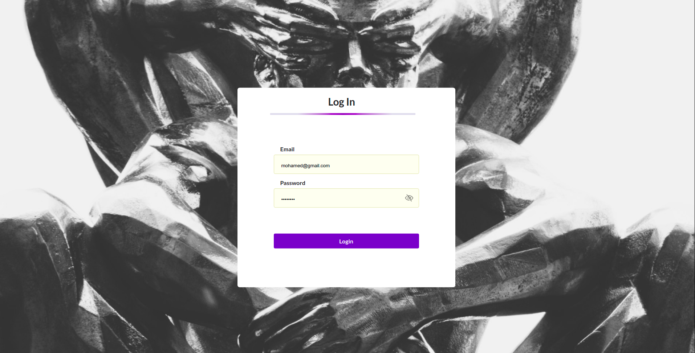
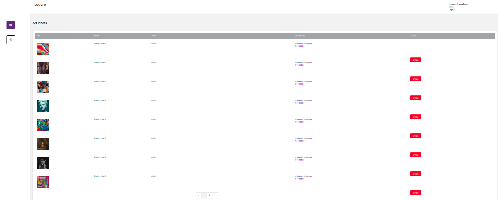
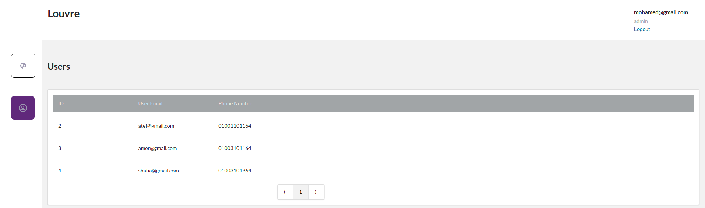
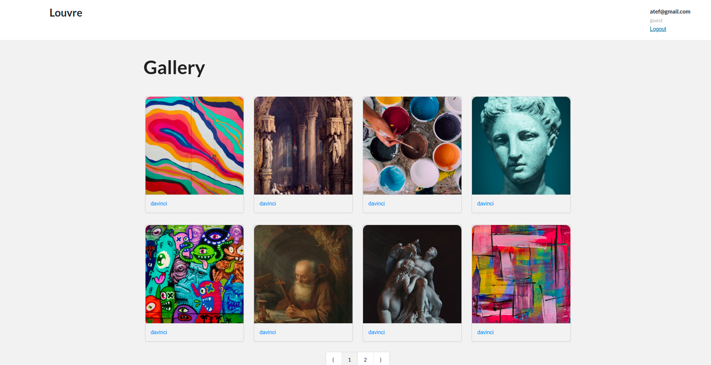
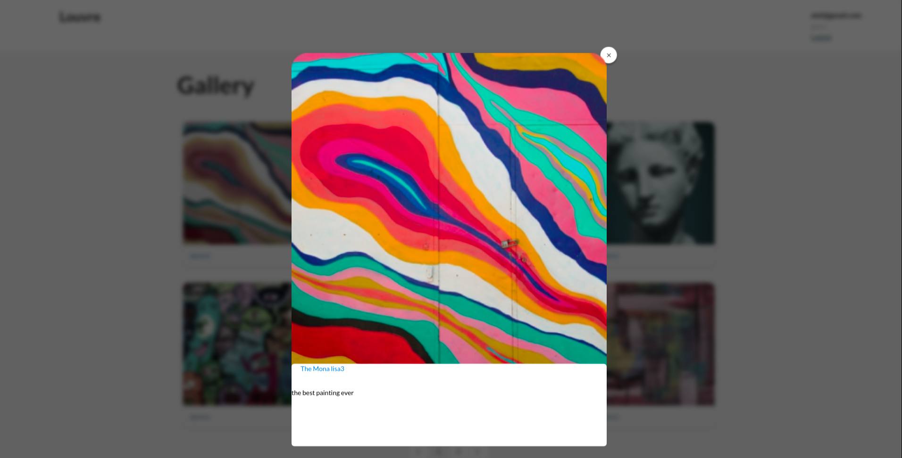

# Online-Louvre
An online web-application that allows you to view art!

## How to run
1- copy .env file in the api folder (backend)

.env example:

- DB_HOST=mongoURI
- JWT_PRIVATE_KEY=privateKey
- CLOUDINARY_CLOUD_NAME=cloudinaryname
- CLOUDINARY_API_KEY =cloudinaryapikey
- CLOUDINARY_API_SECRET =cloudinarySeceret

2- copy the other .env file in the client folder (frontend)
 
 .env example:
  - REACT_APP_BASE_URL = "http://localhost:3000/api"
  
  
  
3- access the api folder , run "npm install"  then run "npm start" and the backend should be running

4- access the client folder, run "npm install" then run "npm start" and frontend should be running and you can access it from browser

5- you will find an "Apis.json" file which contains the api endpoints for the backend. You can import it in postman and use the requests to perform crud operations on the backend instead of using the frontend

## Screenshots

